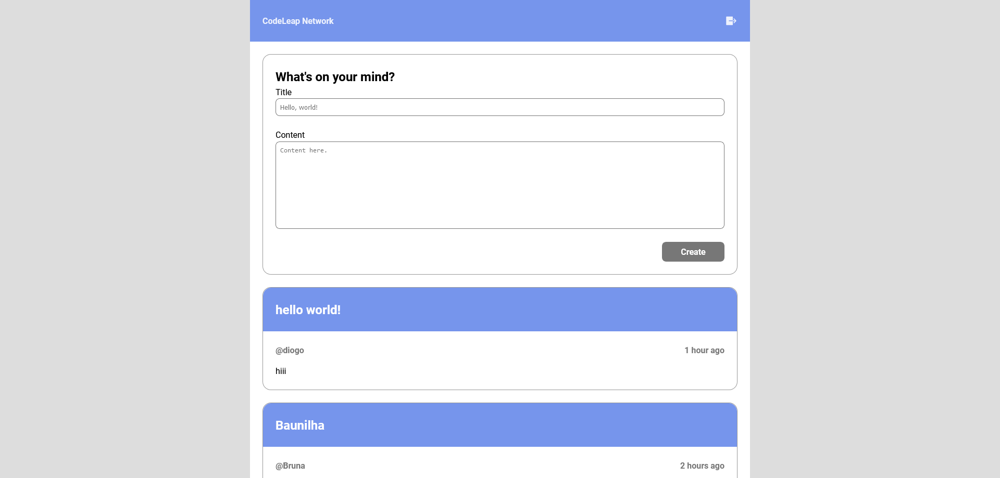

# CodeLeap

**pt.** Projeto desenvolvido como parte do processo de seleção da CodeLeap.

**en.** Project developed as parte of the CodeLeap's hiring process.

# Overview

**pt.**
Este projeto é de uma aplicação web front-end aonde um usuário (devidamente autenticado) é capaz de 

- Visualizar uma lista de posts, carregados via uma o consumo de uma API.
- Criar um novo post.
- Editar e Deletar posts próprios.

**en.**
This project is a web front-end application in which the user (properly authenticated) is capable of

- View a list os posts, loaded via API call.
- Create a new post.
- Edit and Delete their own posts.

## Feito com (Built with)

- React

## Links

- [Vercel](https://codeleap-frontend-test-pl3k.vercel.app/)

## Intruções (Instructions)

**pt.**
Para caso decida clonar este repositório, após o processo, execute:

`yarn`
`yarn dev`

**en.**
In case you want to clone this repository, after such process, run: 

`yarn`
`yarn dev`